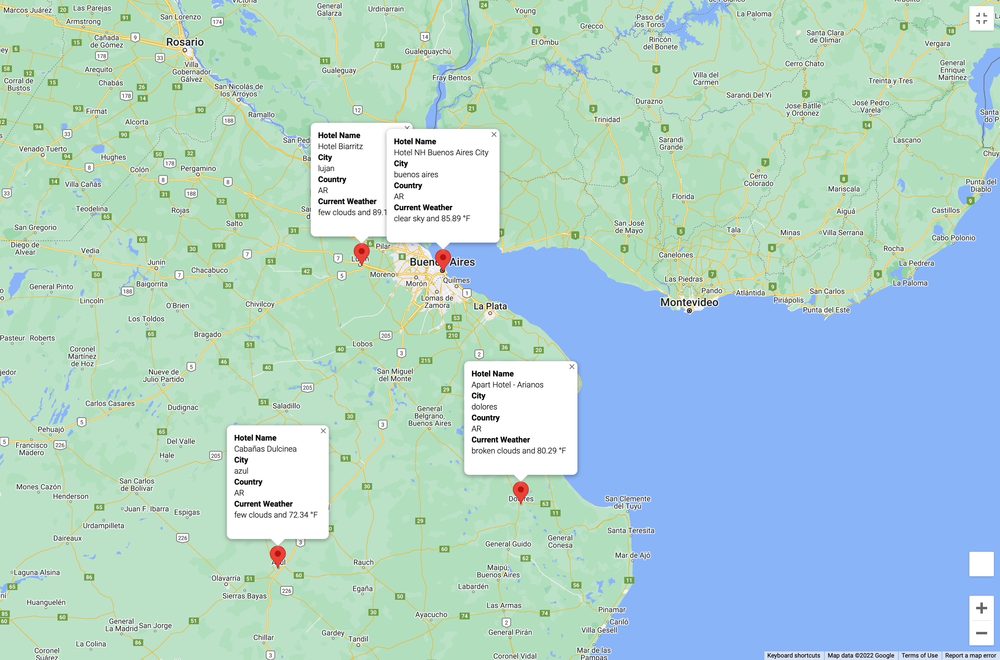

# World Weather Analysis

This project has been challenging but a lot of fun. I did an analysis for PLANMYTRIP, one of the leading travel technology companies providing services for the hotel and lodging industry, where I put to use a combination of skills from Python, Pandas, Matplotlib and SciPy statistics.

The purpose of this project is to create 2000 random coordinates (latitudes and longitudes) and retrieve weather data for the cities that belong to those coordinates.
With this information, we will be able to offer our clients recommendations on possible travel destinations and the hotels in which they can stay during their vacations.

Also, to create an interactive experience, we have created a map on Google Maps, which shows us which cities our customers can visit based on their weather preferences.

And as if that were not enough, our map will have markers, which, when selected, will provide our clients with information about the destination such as the name of the city, country code, maximum temperature and the name of a nearby hotel.

It's time to pack your bags! ✈️

